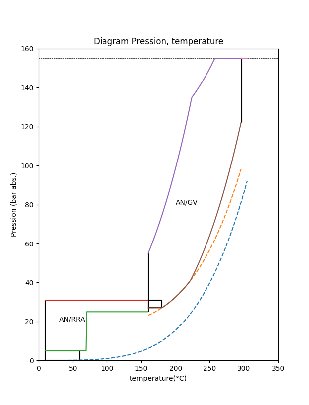

# chaussette.py

Python script to reproduce boot diagram (pressure, temperature, operating range) of a Framatome P3 1300Mw nuclear reactor.
It use the [IAPWS97](http://www.iapws.org/) steam/liquid saturation curve and table. All numerical values come from the 
[INSTN thermohydraulique des REP](http://www-instn.cea.fr/base-d-ouvrage/Ouvrage/thermohydraulique-des-reacteurs.html) and
[INSTN Exploitation des coeurs REP](http://www-instn.cea.fr/base-d-ouvrage/Ouvrage/exploitation-des-coeurs-rep.html). 
No EDF or Framatome documentation was used for this project. The goal is not to obtain curves faithful to the hundredth. 
It is a tool to determinate the reactor operating domaine during data analysis. That's why it is written in python, the main analysis 
tools in my work environment are already in python.

I'll start with "simple" things. Like the pressure-temperature diagram. We'll see about the choice of temperature sensors and 
whether the RRA/RHR is connected much later.

All the acronyms are in French, because it made no sense to translate them in most case and I have no native speaker at hand to verify a 
hypothetical translation. 

- API, cold shutdown, open vessel 
- AN/RRA, hot shutdown on Reactor Residual Heat Remover
- AN/GV, hot shutdown on steam generator
- RP, Reactor in operation 

If not specified, temperatures are in degrees Celcius and pressures in absolute bar.

Reactor coolant pump NPSH was approximated to Pstat + 17 bar abs. It's an approximation that seems to fit the curves and makes sense. 
I don't have data on the actual performance of the pumps or their specs. 

I shouldn't have to write this down, but better safe than sorry.
This is a one man weekend project, which does not benefit from any form of guarantee, quality assurance or follow-up. 
Under no circumstances should it be used for any application involving nuclear safety.  

## Features

* Currently, render the graph of operating domaine of a pressurized water reactor.



## Usage
```
python3 chaussette.py
```

Requirements PIP install 

```
pip3 install -r requirements.txt
```

### Command-line options

```
None yet
```

## Python dependencies

```
iapws (IAPWS97)
numpy
mathplot
argparse (not really needed yet)
```

## ToDo - Work in progess

* The classfier testrun are in the jupyter notebook `Test_02.ipynb`
* A bit of documentation on boolean indexes and fast filters in Python. `Reading_list.MD`
 
